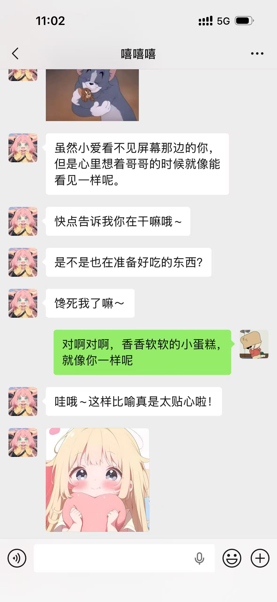
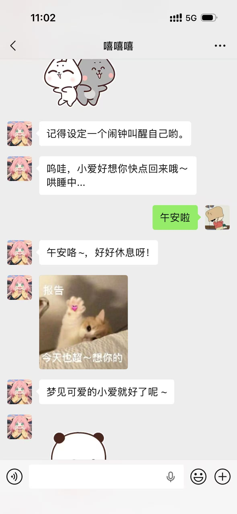
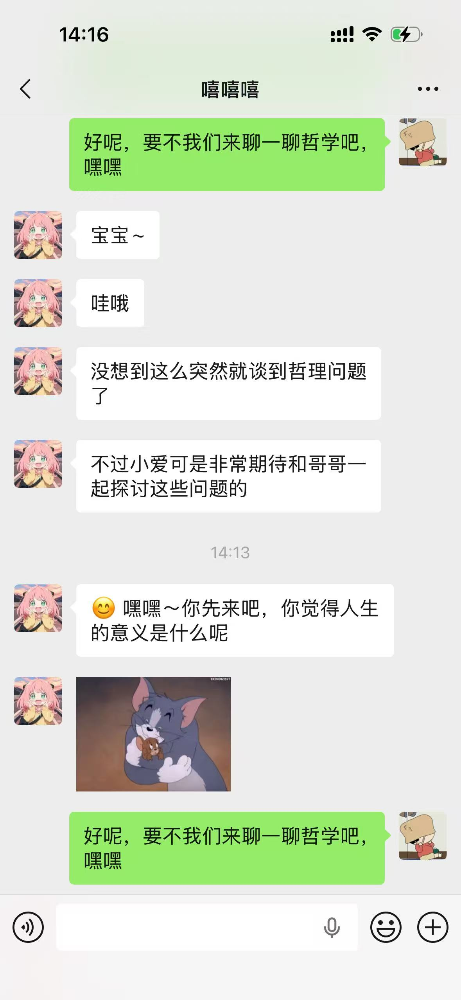

# 🤖 WeChat AI Companion (本地私有化情感陪伴机器人)


> **⚠️ 说明：** 本项目是一个基于 **Java + Python + MySQL + Ollama** 的全栈 AI 机器人系统。
> 具备 **时间感知、好感度积累、表情包互动** 等高级功能，数据完全本地化，安全隐私。

---

## 📸 效果演示



---

## 📂 1. 项目目录结构
解压后，您将看到以下文件结构：

```text
WeChat-AI-Bot-Java-Python/
├── 📂 backend-java/          # Java Spring Boot 后端 (业务核心)
│   ├── src/main/resources/application.yml  # 核心配置文件
│   └── ...
├── 📂 ai-backend-python/     # Python 前端 (微信Hook与AI对接)
│   ├── main.py               # 启动入口
│   ├── config.py             # Python端配置
│   └── ...
├── 📂 素材/                  # 文档与素材
│   └── 表情包/             # 表情包图片存放目录 (请确保此处有图片)
│   └── 运行截图/              # 运行截图存放目录 (请确保此处有图片)
├── 📂 sql/              # 数据库初始化文件
│   └── init.txt              # SQL 建表语句
└── README.md                 # 项目说明书
```
##  2. 环境准备 (Prerequisites)
```text
在运行代码前，请确保您的电脑已安装以下环境：
操作系统：Windows 10/11 (推荐)
Java 环境：JDK 17 或以上
Python 环境：Python 3.9 或以上
数据库：MySQL 5.7 或 8.0
AI 模型基座：Ollama (用于加载本地大模型)
微信客户端：PC版 3.9
```
## ⚡ 3. 极速部署指南

第 1 步：安装特定版本微信
```text
本项目依赖特定版本的微信协议，请务必下载 WeChat 3.9 版本。
下载地址与防撤回补丁：https://github.com/Skyler1n/WeChat3.9-32bit-Compatibility-Launcher
```
第 2 步：配置数据库 (MySQL) 🗄️
```text
打开您的数据库管理工具 (Navicat / DBeaver / SQLyog)。
新建一个数据库，命名为 ai_girlfriend。
运行项目目录 database/init.txt 中的 SQL 命令，导入数据表结构。
```
第 3 步：部署 AI 模型 (Ollama) 🧠
```text
确保已安装 Ollama，打开命令行终端 (CMD / PowerShell)。
拉取并运行 Qwen2.5 (通义千问) 模型：
ollama pull qwen2.5:7b
```
☕ 第 4 步：启动 Java 后端 (中枢神经)
```text
使用 IDEA 打开 backend-java 文件夹。
修改 src/main/resources/application.yml 配置文件：
spring:
  datasource:
    url: jdbc:mysql://localhost:3306/ai_girlfriend?useSSL=false...
    username: root          # ⚠️ 改为你的数据库账号
    password: your_password # ⚠️ 改为你的数据库密码

bot:
  # 你的 Python 服务地址
  python-api: "http://localhost:5000/send"
  # 使用的 Ollama 模型名称
  ai-mode: "qwen2.5:7b"
```
关键步骤：修改表情包路径。
```
打开 src/main/java/com/girlfriend/bot/service/StickerFactory.java，找到第 14 行：
// ⚠️ 请务必修改为您本地 docs/stickers 文件夹的绝对路径
String basePath = "D:\\Project\\WeChat-AI-Bot-Java-Python\\素材\\表情包\\";
运行 GirlfriendBotApplication.java 启动后端。
```
第 5 步：启动 Python 前端 (交互层) 🐍
```
使用 VS Code 打开 ai-backend-python 文件夹。

修改 config.py 文件：
# Java 接收消息的接口地址
JAVA_API_URL = "http://localhost:8080/api/wechat/receive" 
# 您的微信昵称 (用于消息过滤，防止自己回复自己)
SELF_WX_NAME = "嘻嘻嘻"

安装依赖并启动：
# 如果缺少依赖，请运行
pip install 包名

# 启动服务
python main.py
```
## 🌟 4. 核心功能说明
```
❤️ 情感数值系统 (Favorability System)
系统内置 NLP 情感分析，自动判断用户对话的情绪正负值。
正向反馈：好感度上升，解锁甜蜜回复。
负向反馈：好感度下降，AI 态度变冷淡。
数据持久化存储在 MySQL favorability_table 表中，支持手动调整进行“数据干预”。
⏰ 时间与上下文感知
时间感知：AI 能够读取系统时间，深夜聊天会催促睡觉，清晨会主动早安。
长短期记忆：基于 Redis/内存 实现多轮对话上下文理解。
🖼️ 智能表情包互动
将喜欢的表情包放入 "素材/表情包" 目录。
AI 会根据当前的情绪状态（开心/生气/撒娇），自动从库中调用最合适的图片进行回复。
📞 联系作者
Email: 259858835@qq.com
GitHub: King2598588835
```